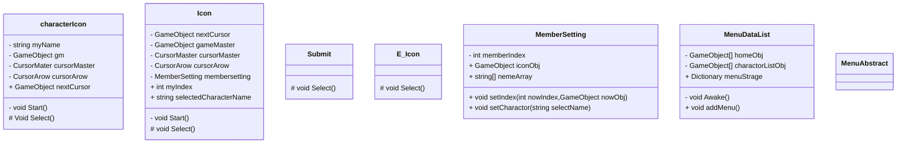

# スクリプトの設計書

各スクリプトの変数の受け渡しが複雑になってきたため、ここで全体の構成を整理する。

# 各スクリプトファイルの挙動

## システムスクリプト
### CursorArow
* カーソルとなるObjectの保存
* 十字キーによるCursorIndexの変動パターンの変更
* 決定ボタンの入力を取得
* CursorIndexをUIに紐づける
    * Indexが変わったら、カーソルを移動させる

### CursorMaster
* CursorArowの
”十字キーによるCursorIndexの変動パターンの変更”
の変更するパターンを指定する

### MenuAbstract
* cursorのMenuとなるために継承させる抽象クラス
* 自オブジェクトの画像の変換
* 決定ボタンを押した際の挙動を記述する抽象メソッドを設定

### MenuDataList
* CursorのmenuをDictonary<string,GameObject[]>として保存する
* Awakeで"home","charactorList"のMenuを登録する

### MemberSetting
* charactorListで選択したキャラクター名を保存するためのArray（nameArray）を設定
* Iconを選択した際に、そのIconのIndexとGameObjectを取得する
* charactorListを選択した際に、そのキャラクターのNameをnameArrayに保存
* Icon のname変数にも *↑* のデータを保存

## パーツとなるスクリプト
アタッチしたオブジェクトごとに変数の内容が違う。

### Icon : menuAbstrant
1. MemberSettingに自身のIndexとObjectを送信
2. cursorArowに次のカーソルとなるオブジェクトを送信
3. cursorMaterから、カーソルを変換するパターンをcharacterListに変換
4. cursorArowのIndexを初期化し、反映

### E_Icon : menuAbstract
現在、機能は未実装

# クラス図
<table>
<th>可視性</th><th>意味</th><th>効果</th>
<tr><td>＋</td><td>Public</td><td>パッケージ外からでも使える</td></tr>

<tr><td>ー</td><td>Private</td><td>そのクラス内でしか使えない</td></tr>

<tr><td>＃</td><td>Protected</td><td>親子関係同士のクラス両方</td></tr>

<tr><td>~</td><td>Package</td><td>パッケージ内ならどこでも使える</td></tr>

</table>

