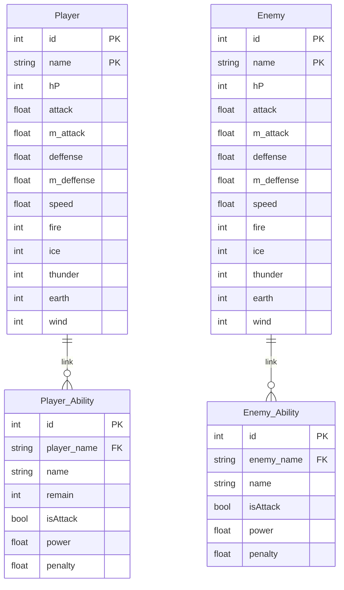
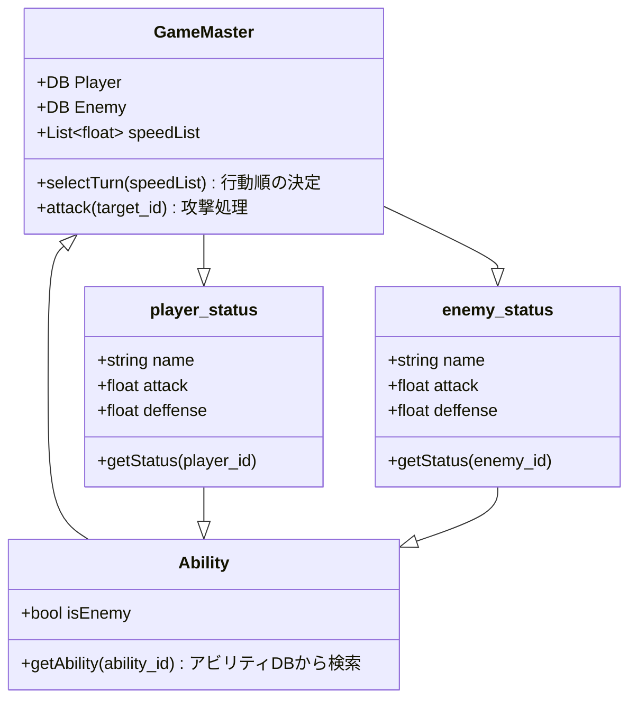
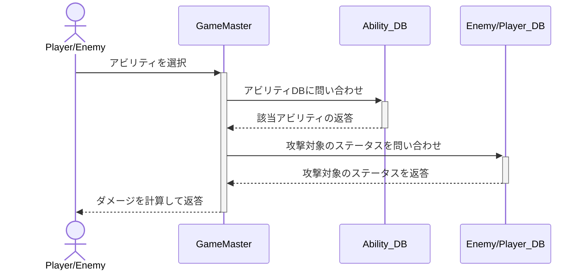

# キャラクターとアビリティのER図

```mermaid
erDiagram
  Player{
  int id PK
  string name PK
  int hP
  float attack
  float m_attack
  float deffense
  float m_deffense
  float speed
  int fire
  int	ice
  int	thunder
  int	earth
  int	wind
}

  Player_Ability{
  int id PK
  string player_name FK
  string name
  int remain
  bool isAttack
  float power
  float penalty
}
Enemy{
  int id PK
  string name PK
  int hP
  float attack
  float m_attack
  float deffense
  float m_deffense
  float speed
  int fire
  int	ice
  int	thunder
  int	earth
  int	wind
}
Enemy_Ability{
  int id PK
  string enemy_name FK
  string name
  bool isAttack
  float power
  float penalty
}

Player||--o{Player_Ability : link
Enemy||--o{Enemy_Ability : link
```
# アビリティ発動のクラス図

```mermaid
classDiagram
class GameMaster{
+DB Player
+DB Enemy
+List~float~ speedList
+selectTurn(speedList) 行動順の決定
+attack(target_id) 攻撃処理
}

class player_status{
+string name
+float attack
+float deffense
+getStatus(player_id)
}
class enemy_status{
+string name
+float attack
+float deffense
+getStatus(enemy_id)
}
class Ability{
+bool isEnemy
+getAbility(ability_id) アビリティDBから検索
}

GameMaster --|> player_status
GameMaster --|> enemy_status

GameMaster <|-- Ability
player_status --|> Ability

enemy_status --|> Ability
```
# データの推移

```mermaid
sequenceDiagram
Actor Player/Enemy

Player/Enemy ->> +GameMaster:アビリティを選択
GameMaster ->> +Ability_DB:アビリティDBに問い合わせ
Ability_DB -->> -GameMaster:該当アビリティの返答
GameMaster ->> +Enemy/Player_DB:攻撃対象のステータスを問い合わせ
Enemy/Player_DB -->> -GameMaster:攻撃対象のステータスを返答
GameMaster -->> -Player/Enemy:ダメージを計算して返答
```
